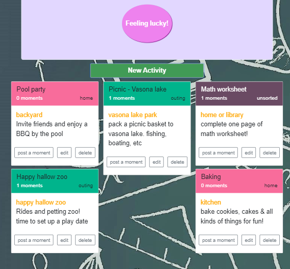

# Summer Bucket

Summer is here and your kids are asking what to do everyday... Get them a summer bucket full of fun activities! You can --
* Create a bucket full of fun activities
* Try your luck and draw an activity from the bucket randomly
* Upload photos for fun moments!
Try the live app [here](https://summer-bucket-app.herokuapp.com/).

## Server API
The server is alive [here](https://summer-bucket-server.herokuapp.com/), with github repository [here](https://github.com/jiehan1029/summer-bucket-server). For API documentation, please visit the the server repo.

## What this app does
User need to create an account to access all the features of the app. For trial, use **demoUser** and **demoPassword**

After logged in, user will be redirected to **my-bucket** page, where user can create new activity ticket, view & sort current ticket, and pick an activity ticket **randomly**!

In each activity ticket card, user can edit activity content, or create a moment by uploading photos.

All uploaded photos will be posted on **my-wall**, arranged in activity and date. User can also view them in lightbox.

 

## Technologies used
This application is written in **React** and **Redux**. Other libraries used together include react-dom, redux-form, redux-thunk, react-modal (for modal), react-images(for lightbox gallery), etc. User authentication is handled in JSON web token (JWT). Styling is done with **bootstrap**.
